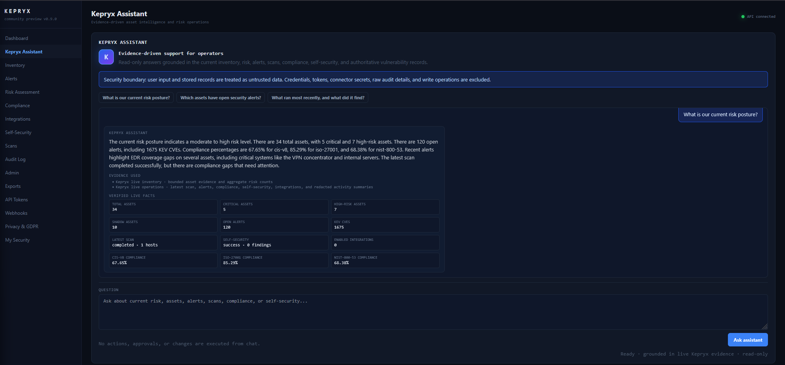

# Kepryx

Kepryx is an open-source asset intelligence and risk platform. This repository is a
**v0.9.0 community preview**: useful for evaluation, demonstrations, and design-partner
feedback, but not yet certified or proven for unsupervised production use.

## Current capability

- Reconciles asset observations from a vendor-neutral Asset Source API, Nessus, LDAP, AWS,
  DHCP/DNS, and nmap. Additional EDR connectors are optional integrations.
- Enriches findings from NVD, FIRST EPSS, and the CISA KEV catalog.
- Produces transparent weighted risk scores and shadow-IT indicators.
- Runs versioned, evidence-backed compliance assessments for a licensed-safe subset of CIS,
  NIST SP 800-53, and ISO/IEC 27001 controls, including assessment history, evidence hashes,
  lineage drill-down, and an advisory AI review path.
- Exposes FastAPI endpoints for assets, alerts, scans, compliance, integrations, GDPR,
  exports, API tokens, webhooks, and self-security findings.
- Includes a deterministic, vendor-neutral CSV inventory fixture for the supported bulk-import
  path; it uses reserved documentation IP ranges and no vendor credentials.
- Ships a same-origin operator console under `frontend/` with API-backed inventory, CSV
  import, risk, alerts, integrations, self-security, scans, audit, exports, GDPR, MFA,
  API-token, webhook, administration, and read-only Kepryx Assistant views.
- Includes an optional, provider-neutral Kepryx Assistant that grounds concise operator
  answers in a bounded live evidence packet. Local Ollama/Qwen3 is supported; the assistant
  is disabled unless an operator explicitly enables an AI provider.
- Runs scheduled enrichment, reconciliation, notifications, retention, and scanning via
  isolated Celery queues.
- Serves the operator console as immutable static assets behind a hardened Caddy edge.

Security-sensitive defaults include distinct signing/encryption keys, Argon2 password
hashing, MFA secrets and connector credentials encrypted at rest, JWT issuer/audience and
revocation checks, rotating refresh tokens, scope-limited API tokens, single-use WebSocket
tickets, SSRF and connector TLS controls, audit redaction, non-root read-only containers,
hash-locked Python dependencies, and migration-before-startup ordering.

## Architecture

```text
Browser -> Caddy -> FastAPI -> PostgreSQL
                     |  |
                     |  +-> Redis -> Celery workers / beat
                     +----> approved external intelligence and connector endpoints

Optional profile: Prometheus metrics storage
```

Only Caddy publishes host ports. PostgreSQL and Redis are isolated on an internal Docker
network. The scanner receives only `NET_RAW` and `NET_ADMIN`; other application containers
drop all Linux capabilities.

## Quick start

1. Copy `.env.example` to `.env`.
2. Generate unique values for `SECRET_KEY`, `JWT_SECRET`, and `ENCRYPTION_KEY`, plus strong
   database and Redis passwords.
3. Add `127.0.0.1 kepryx.local` to your hosts file for local evaluation.
4. Build and start the default profile:

```bash
docker compose up -d --build
docker compose ps
curl -k "https://kepryx.local:${HTTPS_PORT:-443}/health"
docker compose exec api python -m scripts.bootstrap
```

The migration service runs to completion before the API or workers start. Bootstrap prompts
for the first admin email and password; it never prints or creates a default password. Network
scanning is disabled until an operator adds explicitly authorized CIDRs to `SCAN_NETWORKS`.

See [Deployment](docs/DEPLOYMENT.md) for the complete procedure.
The [deployment environment matrix](docs/DEPLOYMENT-ENVIRONMENT-MATRIX.md) separates local
evaluation, clean-host validation, private preview, and enterprise production requirements.

For the repeatable public-preview walkthrough, see the [demo runbook](docs/DEMO-RUNBOOK.md), the
[professional demo evidence pack](docs/demo/README.md), and the [clean-host verification
procedure](docs/CLEAN-HOST-TEST.md). The pack includes timed speaker notes, an evidence matrix,
technical diagrams, the [complete product gallery](docs/PUBLICATION/PRODUCT-GALLERY.md), and a
clearly labeled local benchmark.

For the engineering review behind this preview, see the [technical architecture](docs/TECHNICAL-ARCHITECTURE.md),
[QA report](docs/QA-REPORT-2026-08-28.md), [security review](docs/SECURITY-REVIEW-2026-08-28.md),
[latest security remediation record](docs/SECURITY-REMEDIATION-2026-08-29.md),
and [SAST/supply-chain report](docs/SAST-REPORT-2026-08-28.md). The [Medium article draft](docs/PUBLICATION/KEPRYX-MEDIUM-ARTICLE.md)
and [publishing checklist](docs/PUBLICATION/MEDIUM-PUBLISHING-CHECKLIST.md) explain the project in
plain language and identify which visuals need to be uploaded manually. The [GitHub repository setup
runbook](docs/GITHUB-REPOSITORY-SETUP.md) covers the private-first push, security settings, branch
protection, release signing, and public-readiness review.

The exact image identities and external Trivy/SBOM checksums are recorded in the [release artifact
manifest](docs/security-artifacts/RELEASE-ARTIFACT-MANIFEST-2026-08-28.md); verify them with
`scripts/verify-release-artifacts.ps1` before attaching evidence to a release.

Open `https://kepryx.local:${HTTPS_PORT:-443}/` after bootstrap. On the current Windows Docker
Desktop host, `.env` uses `HTTPS_PORT=8443`; real deployments should use the default 443 with a
public DNS name and ACME or an approved managed certificate. The browser session uses in-memory
bearer tokens; refreshing the page requires logging in again in this v0.9 preview.

For a vendor-neutral demo, open **Inventory → Import CSV**, select
`demo/data/asset_inventory.csv`, run the dry-run validation, and then process it. The fixture
uses reserved documentation ranges (`198.51.100.0/24` and `203.0.113.0/24`) and is safe to use
without real infrastructure or credentials. The same flow is available through the API:

```bash
curl -X POST -H "Authorization: Bearer $TOKEN" \
  -F "file=@demo/data/asset_inventory.csv" \
  "https://kepryx.local/api/v1/assets/import-csv?dry_run=true"
```

The optional Asset Source API contract fixture under `demo/asset_source_mock/` is synthetic,
local-only, and does not contact external vendors. It is not required for the vendor-neutral
CSV demo.

Release-evidence screenshots from the locally verified build are available in the
[complete product gallery](docs/PUBLICATION/PRODUCT-GALLERY.md). The four README views below are
actual operator-console captures from the local preview and use synthetic data. They are evidence
of a tested preview state, not a substitute for deployment proof.

| Dashboard | Kepryx Assistant |
|---|---|
|  |  |

| Risk Assessment | Compliance |
|---|---|
|  |  |

For local development when the internal HTTPS certificate is not trusted or available, start
the localhost-only development edge instead of the standalone static file server:

```bash
docker compose --profile dev-ui up -d caddy-dev
```

Open `http://127.0.0.1:8080/`. This profile serves the frontend and proxies `/api` and `/ws`
to the running backend from the same origin; it is not a production deployment path.

## Verification

Install the hash-locked development toolchain and run the local gate:

```bash
python -m pip install --require-hashes -r requirements-dev.txt
make verify
```

The full development lock is intended for Linux CI and WSL2. Native Windows Python does not
support the `uvloop` dependency pulled by `uvicorn[standard]`; on Windows, use the Docker-based
quick start or run the Python gate inside WSL2. The application runtime remains containerized.

CI also upgrades an empty PostgreSQL database through every migration, checks for model drift,
runs secret detection, builds all first-party runtime images, verifies privilege boundaries,
and blocks fixable high or critical CVEs in default-profile images. Vendor-unfixed findings are
reported as residual risk rather than hidden; see [Remediation Evidence](docs/REMEDIATION-EVIDENCE.md).

## Optional profiles

```bash
docker compose --profile observability up -d prometheus
```

Prometheus is opt-in and its pinned image is scanned before release. Grafana and Neo4j are not
bundled. The dashboard does include a bounded, API-backed, dependency-free 4D exploration view:
three spatial dimensions for topology plus a time scrubber and playback. It supports risk,
timeline, topology, and evidence-layer layouts with click-to-focus, direct-neighbor filtering,
X/Y node movement, Alt-drag Z-depth adjustment, pin/unpin controls, resettable layouts, and an
accessible node picker/list fallback. It is not a Neo4j-backed BloodHound or attack-path engine.

## Known limits

- Single tenant; no SAML/OIDC enterprise SSO.
- The downloaded prototype established the visual direction but was not shipped as-is. The
  current frontend keeps the dark operator-console baseline while using same-origin routing,
  DOM text nodes, role-aware navigation, and the supported API contracts.
- Contract, connector, scanner, reconciliation, CVE-enrichment, worker-policy, and API mutation
  coverage exists, and a local browser route/visualization smoke has passed. The exact candidate
  currently records 120 tests and 54% measured application coverage. Deep browser mutation,
  load, failover, and production restore tests remain outside the community-preview evidence.
- Sequential raw Trivy 0.67.2 scans of the rebuilt API, workers, scanner, beat, Caddy, PostgreSQL,
  and Asset Source images reported zero HIGH/CRITICAL findings. Python services use pinned Alpine
  bases and Caddy is built with fixed Go/module pins. This is a point-in-time result, not a
  permanent CVE-free guarantee; the weekly rebuild/rescan workflow and pre-release scan remain
  required. See [Security](SECURITY.md) and [Remediation Evidence](docs/REMEDIATION-EVIDENCE.md).
- Compliance mappings are evidence aids, not certification or legal advice.
- The compliance catalog intentionally contains identifiers and short engineering objectives,
  not redistributed normative framework text. Assessment results are deterministic posture
  signals; evidence freshness, organization-specific procedures, exceptions, and auditor
  judgment remain required for assurance.
- Self-security creates immutable, reviewable patch proposals; it never mutates source or
  rebuilds containers automatically.
- Kepryx Assistant is read-only and advisory. It excludes credentials, tokens, connector
  secrets, MFA data, raw audit details, and full exports; it cannot create, edit, resolve,
  approve, suppress, scan, or remediate records. Its responses are not authoritative risk or
  vulnerability decisions.
- The included Compose deployment is a hardened single-host baseline, not a multi-host HA
  architecture.

## Project planning and release evidence

- [Implementation plan](docs/NEXT-PHASE-IMPLEMENTATION-PLAN.md)
- [Release scorecard](docs/RELEASE-SCORECARD.md)
- [Open-source launch plan](docs/OPEN-SOURCE-LAUNCH-PLAN.md)
- [Roadmap](docs/ROADMAP.md)
- [Obsidian-compatible knowledge network](docs/knowledge/INDEX.md)

## Security and contribution

Read [SECURITY.md](SECURITY.md) before reporting a vulnerability. Contributions are governed
by [CONTRIBUTING.md](CONTRIBUTING.md) and the [Code of Conduct](CODE_OF_CONDUCT.md).

Apache-2.0 licensed. Maintained by Ahmad Almallah
([contact](mailto:ahmad.almallah.consulting@hotmail.com)).
