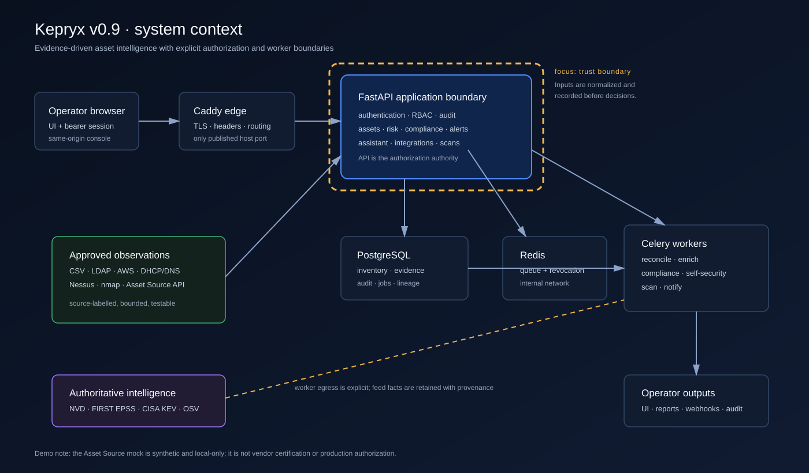
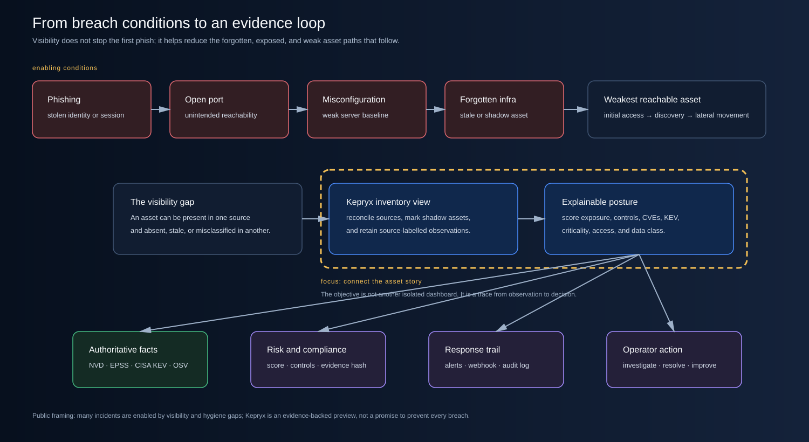
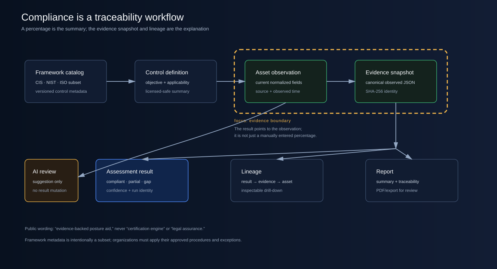
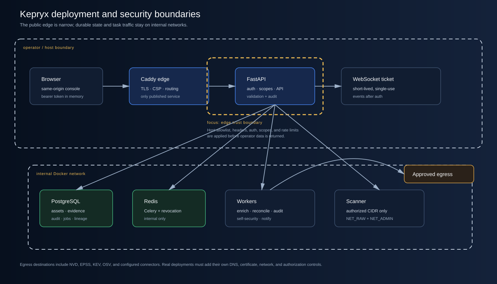

# Kepryx: the asset intelligence layer security teams are still missing

*How I built an open-source way to connect inventory, vulnerability facts, risk, compliance evidence, and daily security operations.*

## Security usually starts with a visibility problem

How do most infrastructure breaches start?

Sometimes it is phishing. Sometimes it is an open port. Sometimes it is a server with a
misconfiguration. Sometimes it is old infrastructure that everyone forgot about.

The entry point is different, but the next part is often familiar. After the first access, the
attacker starts looking through the network and the IT environment. They search for the weakest
machine, the forgotten system, the shadow asset, the account with too much access, or the server
that nobody is monitoring anymore.

I am deliberately saying “many incidents are enabled by these conditions,” not that every breach
starts the same way. Security is not a single story. It is a chain of decisions, exposures, and
missed evidence.

That is why inventory matters.

## The problem is not a lack of security tools

The current market has many good solutions for the first phase. There are excellent tools for
endpoint detection, vulnerability management, cloud security, identity, SIEM, network monitoring,
and compliance.

The problem is what happens between those tools.

You may have an Excel file, an asset discovery solution, a vulnerability scanner, an EDR console,
cloud accounts, DHCP/DNS records, and a compliance spreadsheet. Each one knows something. The
security engineer is then asked to build one trustworthy picture from all of them.

This costs time. It creates duplicate work. It makes it harder to answer simple questions:

- What assets actually exist?
- Which assets are shadow IT or stale?
- Which vulnerabilities are confirmed by authoritative sources?
- Why did this asset receive a high risk score?
- Which compliance result came from which observation?
- What changed after the last scan?

Security and managing enterprise assets is a pain. This is a fact. I know it from experience. It
is also a good challenge because it sits between IT operations, security engineering, vulnerability
management, and GRC.

## Introducing Kepryx

I am introducing Kepryx, an open-source Asset Intelligence & Risk Platform.

The objective was simple:

> Create a next-generation inventory solution for IT, security, and GRC teams that is free to use,
> transparent about its decisions, and open to community improvement.

This is not a theory or a research paper. It is a tool that took time, nights, and a lot of
Security, QA, SAST, and operational testing to reach a useful starting point.

It may not be perfect. I am not presenting it as a finished enterprise product. I am presenting it
as a serious community preview that people can inspect, run, test, challenge, and improve.

## Screens from the running console

The following are screenshots from the actual local Kepryx console, not mockups. They were captured
from the verified preview build using synthetic test data. The values are point-in-time and will
change when the seed data, scans, enrichment jobs, or compliance audits are run again.

*Figure 1 — The actual Kepryx operator dashboard. The opening view puts asset count, critical and
high-risk posture, shadow IT, open alerts, KEV coverage, the interactive relationship map, and recent
audit activity in one place. This capture shows 34 assets, 5 critical assets, 7 high-risk assets,
10 shadow-IT assets, 120 open alerts, and 1,675 KEV records from the local synthetic preview run.*

*Figure 2 — The actual Kepryx compliance view. The framework percentages are only the summary; the
control-evidence table shows the asset, control, status, observed values, and assessment timing that
an engineer needs to review the result. These numbers are local preview data, not a certification.*

The screenshots are intentionally branded with the Kepryx dark operator-console style. In the
publication version, I keep the raw product view visible first and use the [complete product
gallery](PRODUCT-GALLERY.md) to select the workflow capture that supports each explanation. That
keeps the product recognizable while making the technical story easy to follow.

## What Kepryx does

Kepryx connects the asset story into one workflow:

1. Ingest observations from CSV, a local Asset Source API, nmap, Nessus, LDAP, AWS, DHCP/DNS, and
   optional EDR integrations.
2. Normalize and reconcile multiple observations into a source-labelled asset view.
3. Identify shadow, stale, end-of-life, exposed, or weakly controlled assets.
4. Enrich vulnerability records with NVD, FIRST EPSS, and the CISA Known Exploited Vulnerabilities
   catalog. OSV supports the self-security dependency path.
5. Calculate a transparent risk signal using CVE evidence, KEV presence, controls, exposure, access,
   criticality, and data classification.
6. Generate alerts, signed webhooks, audit events, and operator actions from the resulting posture.
7. Run a versioned subset of CIS Controls, NIST SP 800-53, and ISO/IEC 27001 observations.
8. Link compliance results to hashed evidence snapshots so an engineer can follow the chain back to
   the asset observation.
9. Provide an optional local Qwen3/Ollama Assistant that can explain bounded evidence but cannot
   change records or author vulnerability truth.

The key idea is not “AI will decide security.” The key idea is that the engineer should have a
better evidence path before making a decision.

*Figure 3 — The system context. Inputs are normalized before risk and compliance outputs are shown to operators.*

## From a breach condition to an evidence trail

The following is the problem I am trying to reduce:

*Figure 4 — A practical breach-enablement story: visibility gaps make it easier for the weakest or forgotten asset to remain unseen. Kepryx connects the observation to a decision and response trail.*

The platform is not a magic prevention layer. It does not stop phishing by itself. It does not
replace a firewall, EDR, SIEM, IAM, or a human incident responder.

What it can do is make the inventory and risk layer more useful:

- record where the observation came from;
- compare conflicting source observations;
- show the difference between managed and shadow assets;
- make risk factors visible instead of hiding them behind one unexplained number;
- make compliance gaps traceable to observed asset fields;
- keep alerts, audit events, and operator action in the same operational story.

## How risk is calculated

The risk engine uses a bounded additive model. It is intentionally understandable. A reviewer can
read the inputs and reproduce why an asset moved from one tier to another.

| Factor | Weight |
|---|---:|
| CVE severity and exploitability | 23% |
| KEV presence | 18% |
| Control coverage | 18% |
| Network exposure | 14% |
| Access method | 9% |
| Business criticality | 10% |
| Data classification | 8% |

CVSS and EPSS are normalized into the same 1–5 scale. A ransomware-active KEV receives a bounded
boost. The final value produces a tier and a recommended action/SLA. The score is a posture signal,
not a probability of breach and not a replacement for an analyst.

This matters because “critical” should have a reason behind it. In a real environment, the reason
may be the combination of an internet-facing system, a KEV-linked vulnerability, weak controls,
and restricted data—not just a label copied from another tool.

## Compliance needs a chain, not only a percentage

Compliance dashboards often show a percentage and stop there. The percentage is useful, but the
engineer also needs to know what produced it.

*Figure 5 — Compliance is represented as a lineage path from framework control to asset observation, evidence snapshot, result, and report.*

Kepryx evaluates a licensed-safe subset of control metadata. For each asset/control pair, it stores
the status, score, rationale, framework version, assessment run, observed values, and a SHA-256 hash
of the canonical evidence object.

The result can be:

- `compliant` when the deterministic rule passes;
- `partial` when a multi-field rule has some but not all of its evidence;
- `gap` when the rule fails or evidence is missing.

This is an evidence-backed posture aid. It is not an ISO certificate, a CIS certification, a NIST
attestation, or legal advice. An organization still needs its approved procedures, exceptions,
sampling, retention, and auditor judgment. The framework links are useful context: [NIST CSF
2.0](https://www.nist.gov/cyberframework), [NVD](https://nvd.nist.gov/), [FIRST EPSS](https://www.first.org/epss/), [CISA KEV](https://www.cisa.gov/known-exploited-vulnerabilities-catalog), and [OSV](https://osv.dev/).

## The architecture in one view

*Figure 6 — The default single-host deployment keeps the public edge narrow and the durable state and task traffic internal.*

The stack is intentionally practical for a community preview:

- FastAPI for the API;
- a static operator console behind Caddy;
- PostgreSQL for durable state and evidence;
- Redis and Celery for task execution;
- separate workers for scan, reconciliation, enrichment, compliance, self-security, and
  notifications;
- optional Prometheus metrics;
- optional local Ollama/Qwen3 for bounded AI assistance.

Only the edge publishes host ports in the default Compose profile. The application and workers run
as non-root containers with read-only defaults and dropped capabilities where their job permits.
The scanner receives only the capabilities it needs. Scan ranges are disabled until an operator
explicitly authorizes them, and the worker checks the authorization again.

## What I tested before calling it a preview

I did not want to rely on “the containers are running” as the only QA result.

| Area | Result |
|---|---|
| Automated tests | 120 passing tests |
| Measured application coverage | 53.63% |
| Ruff and mypy | Passed |
| Bandit | No medium/high findings in 9,845 scanned lines |
| pip-audit | No known vulnerabilities in the locked Python runtime set |
| Secret detection | No findings in the staged tracked candidate |
| Database | Migration head `0007_evidence_compliance`; no model drift |
| Image security | Nine rebuilt first-party images; zero HIGH/CRITICAL Trivy findings |
| SBOM | Nine CycloneDX image SBOMs generated |
| Live acceptance | Auth, inventory, risk, enrichment, compliance, alerts, scans, self-security, Assistant, webhooks, and graph interactions tested locally |

The live platform currently demonstrated 34 assets, 115 open alerts, 1,675 KEV-linked CVE records,
76 dependency packages scanned, 185 graph nodes, and 218 relationships. These are local preview
data points, not a benchmark against a customer environment.

## The part I will not hide

The current scorecard is 82/100 for a v0.9 community preview. The score is not 100 because the
remaining work is real:

- deeper browser mutation tests for multipart import, exports, GDPR, compliance drill-down, and
  the Assistant modal;
- real external-provider contract tests with customer-owned credentials;
- load, soak, queue failure, HA, and production restore evidence;
- public GitHub controls such as private-first peer review, branch protection, and a signed release
  tag;
- customer-owned written authorization before scanning real networks.

The current local stack also has old orphan containers from an earlier Compose project. They are
outside the canonical release file and are not included in the release image claims. This is the
kind of detail I want to document instead of giving a clean-looking but misleading picture.

## Why open source?

I could keep this as a private product, but I think the first step should be open source.

The reason is simple. Asset intelligence touches many environments, and one person cannot design
every connector, control mapping, and operational workflow alone. I want security and IT engineers
to inspect the code, challenge the assumptions, add integrations, improve the evidence model, and
share failure cases.

My goal is to build a useful community under Kepryx. As security engineers, we should contribute to
the community whenever we can. The project is released under Apache-2.0, with a security policy,
contribution guidance, issue templates, and a roadmap.

## How Kepryx adds value

Kepryx is most useful when it becomes the shared evidence layer between teams:

- IT operations can see what exists and what changed.
- Security teams can prioritize exposure and exploitability instead of only counting findings.
- Vulnerability managers can connect NVD/EPSS/KEV facts to affected assets.
- GRC teams can trace control outcomes to observations and evidence hashes.
- Engineers can use the graph to filter, focus, reshape, and inspect relationships rather than only view a static diagram.
- Teams can run a local Assistant without sending the complete inventory to a hosted model, while
  keeping the final decisions under human and system control.

It is not intended to replace every specialist tool. It is intended to reduce the gap between the
tools that already exist.

## Next step: a practical deployment and integration demo

The next article or thread will be practical. It will show how to deploy the community preview,
load the vendor-neutral data source, authorize a lab CIDR, run a scan, enrich a test asset, inspect
the risk explanation, review a compliance gap, resolve an alert, and connect a webhook.

After that, the community can decide which integrations and workflows deserve the next release.

## Conclusion

The security industry does not need another product that only says “your risk is high.” Engineers
need to know what exists, what was observed, why the system evaluated it that way, what evidence
supports the result, and what changed after action was taken.

That is the purpose of Kepryx.

It is a strong starting point, not a perfect final answer. The repository is ready for a private-
first open-source preview, review, and community feedback. If you work in IT, security,
vulnerability management, or GRC, I would like you to test it and tell me where the evidence model
does not match your reality.

— Ahmad Almallah

*Kepryx v0.9.0 is a community preview. It is not certified, does not provide legal advice, and
must be tested and authorized for each deployment.*
