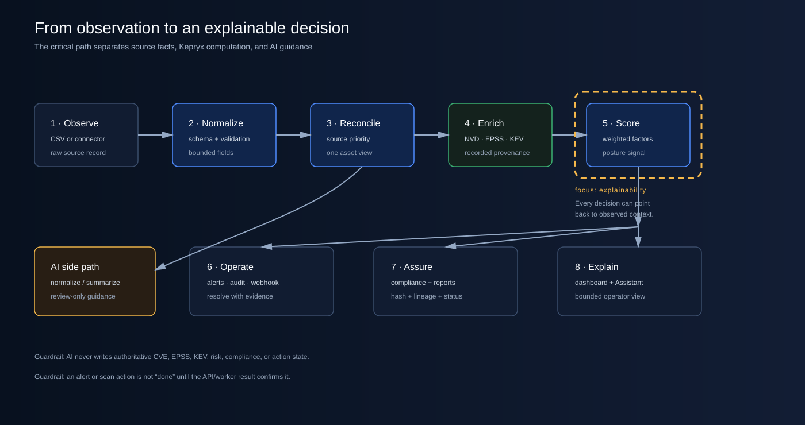

# Kepryx technical architecture

Status: v0.9.0 community preview | Evidence date: 2026-08-29

This document explains what Kepryx does, where decisions are made, which evidence is retained,
and where the current preview stops. It is written for engineers, security reviewers, and design
partners. It is not a production architecture certification or a claim of compliance.

## The problem Kepryx addresses

Infrastructure risk is rarely caused by one missing dashboard. It is usually a visibility problem:
an asset is forgotten, a source reports stale data, a server is exposed, an old package is not
patched, or a compliance statement cannot be traced back to an observation. Kepryx brings asset
observations, vulnerability intelligence, risk scoring, control signals, alerts, and evidence
lineage into one operator workflow.

## System context

The primary path is browser to Caddy to FastAPI. PostgreSQL is the system of record. Redis carries
task and revocation state. Celery workers perform discovery, enrichment, reconciliation,
compliance, self-security, and notification work. Only the Caddy edge publishes host ports in the
default Compose profile.

| Layer | Main components | Responsibility | Security boundary |
|---|---|---|---|
| Operator | React-style static console, browser API client | Login, inventory, risk, alerts, scans, compliance, self-security, reports, Assistant | Same-origin bearer-token session; no secrets in browser storage |
| Edge | Custom Caddy build | TLS termination, SPA delivery, API/WebSocket reverse proxy, security headers | Only public host-facing service; docs and metrics are restricted |
| API | FastAPI routers and dependencies | Authentication, authorization, validation, CRUD, audit events, read models | JWT issuer/audience/type checks, scopes, rate limits, trusted hosts, CORS |
| Durable state | PostgreSQL + Alembic | Assets, CVEs, alerts, scans, integrations, evidence, assessment runs, audit trail | Internal Docker network; migration-before-startup gate |
| Task plane | Redis, Celery workers, beat | Queues and scheduled operations | Internal network; workers use isolated queues and least privilege |
| Intelligence | NVD, FIRST EPSS, CISA KEV, OSV | Vulnerability and dependency facts | Explicit egress; returned values are stored with source/provenance |
| Connectors | CSV, Asset Source fixture, nmap, Nessus, LDAP, AWS, DHCP/DNS, optional EDR | Convert source-specific observations into the Kepryx asset shape | Credentials are encrypted; network targets are validated and bounded |
| Advisory AI | Local Ollama/Qwen3 or configured provider | Normalize or summarize bounded data | Read-only; no action tools; cannot author vulnerability or final risk facts |

## Operational data flow

1. An operator imports a bounded CSV, configures an approved connector, or starts an authorized
   discovery scan.
2. Input validation constrains the shape, size, target, and credential fields before work is
   queued.
3. Connectors return source-labelled observations. The reconciler merges observations using source
   priority and preserves source references instead of silently replacing history.
4. CVE enrichment obtains NVD records and supplements them with FIRST EPSS and the CISA KEV
   catalog. OSV is used by the self-security dependency path.
5. The risk engine computes a bounded score and tier. Alerts are created for defined posture
   conditions and can be dispatched through an HMAC-signed webhook.
6. A compliance run evaluates the versioned catalog against asset observations, stores a result,
   captures a canonical evidence snapshot, hashes the observed content, and links result to
   evidence to asset.
7. The UI, API, CSV/PDF exports, audit log, graph, and Assistant read the resulting state. A task
   is considered complete only when the persisted API/worker result confirms it.

## Risk calculation

The score is an additive, transparent 1–5 model. It is a posture signal, not a probability of
breach and not a replacement for an analyst's decision.

| Factor | Weight | Source of signal |
|---|---:|---|
| CVE severity/exploitability | 0.23 | Highest normalized CVSS or EPSS among asset CVEs |
| KEV presence | 0.18 | Whether any linked CVE is in the CISA KEV catalog |
| Control coverage | 0.18 | none=5, partial=3, full=1 |
| Network exposure | 0.14 | isolated=1, internal=2, dmz=3, cloud=4, internet-facing=5 |
| Access method | 0.09 | mfa+pam=1, mfa/certificate=2, password=4, password-only/none=5 |
| Business criticality | 0.10 | low=1, medium=2, high=3, critical=4, tier-1=5 |
| Data classification | 0.08 | public=1, internal=2, confidential=4, restricted=5 |

CVSS is normalized from 0–10 to 1–5; EPSS is normalized from 0–1 to 1–5. If a ransomware-active
KEV is present, the KEV factor is maximized and the CVE factor receives a bounded one-point boost.
Tiers are Critical at 4 or higher, High at 3 or higher, Medium at 2 or higher, Low at 1.5 or
higher, and Informational below 1.5. The action and SLA are generated from the resulting tier,
EOL status, and KEV presence.

## Compliance and evidence lineage

Kepryx ships a licensed-safe subset of CIS Controls v8.1, NIST SP 800-53 Rev. 5, and ISO/IEC
27001:2022 metadata. The rules inspect asset fields such as name, operating system, authentication
method, control coverage, patch date, endpoint defense, type, and software stack.

For each control and asset, the deterministic worker records:

- `compliant` when the rule passes;
- `partial` when a multi-field rule has some evidence but not all;
- `gap` when the rule does not pass or evidence is unavailable;
- a normalized result score, confidence, rationale, framework version, run ID, and observed time;
- a canonical evidence object with a SHA-256 integrity hash;
- a lineage edge from result to evidence to the source asset.

The percentage is `compliant / applicable results * 100`. It is an engineering measurement of the
catalog and observations present in Kepryx. It is not an audit opinion, certification, or legal
assurance. Organizations still need approved procedures, exceptions, sampling, evidence retention,
and auditor judgment.

## Security architecture

- Authentication uses Argon2 password hashing, JWT issuer/audience checks, MFA support, rotating
  refresh tokens, Redis-backed revocation, and per-IP login throttling.
- Authorization is scope and role based. Admin-only operations include integration management,
  scan-network authorization, token/webhook administration, compliance execution, and proposal
  approval.
- Connector credentials and webhook secrets are encrypted at rest with a key distinct from JWT
  signing material. Secrets are never returned by list endpoints.
- Webhook creation and dispatch enforce a global-only destination policy, reject URL userinfo,
  re-resolve legacy IP literals, sign payloads with HMAC, and disable repeatedly failing records.
- Scan authorization is checked when the request is made and again in the worker. An empty
  `SCAN_NETWORKS` setting disables scanning.
- Runtime images use non-root users, read-only filesystems where compatible, dropped capabilities,
  no-new-privileges, pinned inputs where feasible, and explicit internal/egress networks.

## AI boundary

The optional Assistant and AI ingestion paths are deliberately narrow. The server builds a bounded
evidence packet, removes credentials and sensitive operational data, treats all retrieved values as
untrusted data, and validates structured output. The model may help normalize text or explain
observed facts. It cannot create actions, approve proposals, change controls, set risk, or override
NVD, EPSS, KEV, or OSV data. If the provider is unavailable, the platform returns an explicit
failure instead of pretending that an AI answer was produced.

## Current deployment shape and limits

The default deployment is a hardened single-host Compose baseline. Prometheus is opt-in. Grafana,
Neo4j, and Vault are not part of the canonical current Compose release. The inventory graph is a
bounded API-backed projection with interactive X/Y movement, Alt-drag Z-depth, filters, pinning,
timeline scrubbing, zoom, playback, and reset; it is not a Neo4j-backed BloodHound engine.

The v0.9 preview has 154 passing tests and 63.54% measured application coverage. Deep browser
mutation for every screen, real external-provider synchronization, load/soak, HA/failover, and
customer-owned production restore remain follow-up evidence. These limits are release information,
not hidden defects.

## Related evidence

- [QA notes](QA-NOTES.md)
- [Security remediation record](SECURITY-REMEDIATION-2026-08-29.md)
- [Browser mutation evidence](BROWSER-MUTATION-EVIDENCE.md)
- [Release scorecard](RELEASE-SCORECARD.md)
