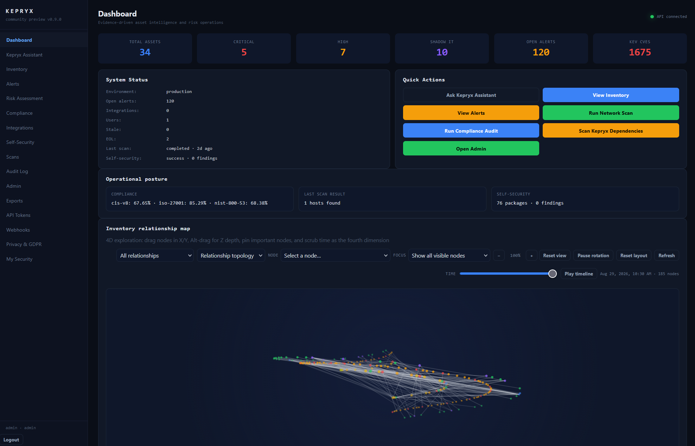
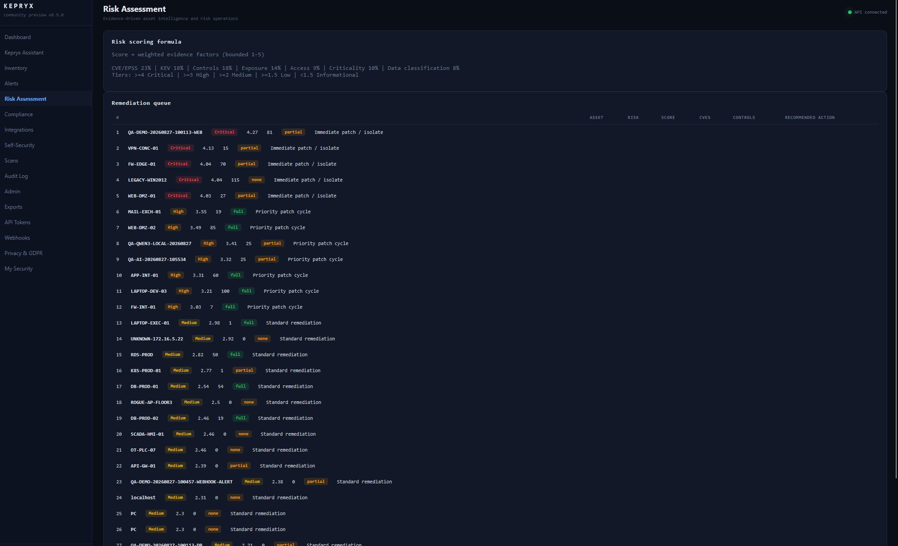
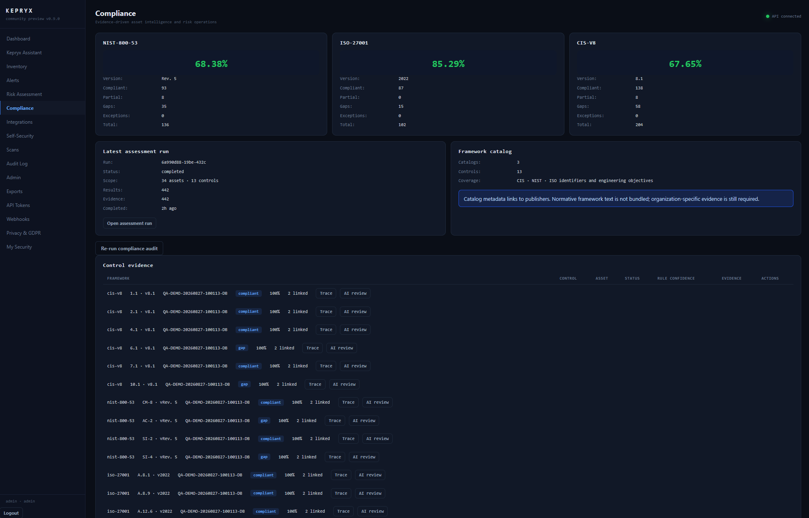
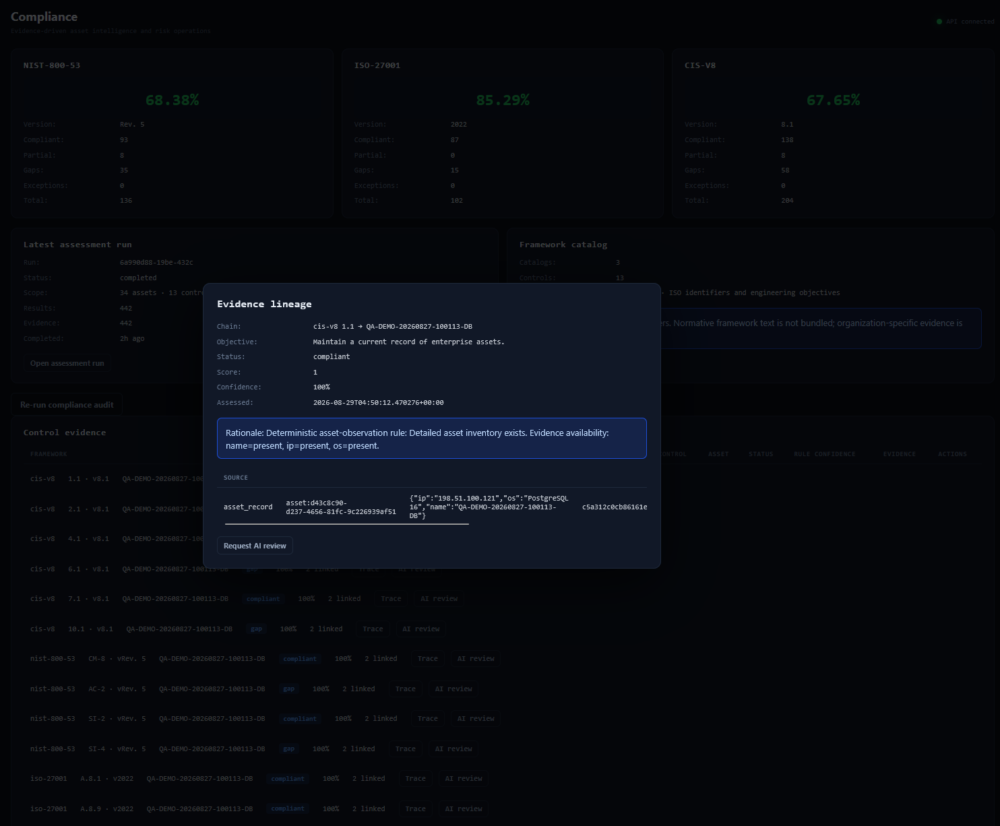
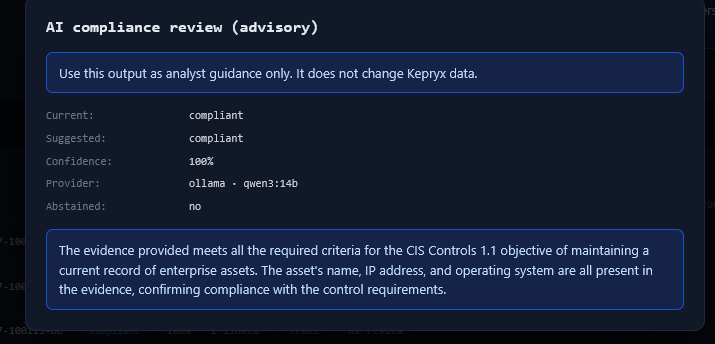

# Kepryx demo evidence pack

This directory is the presentation pack for the Kepryx v0.9.0 community preview. It is designed
for a technical audience: every story is tied to an executable route, fixture, test, or release
record, and every unproven production claim is called out.

## Product preview

These are actual operator-console captures from the local preview build using synthetic data. The
[complete product gallery](../PUBLICATION/PRODUCT-GALLERY.md) contains every product view and
workflow capture, including the interactive relationship map, evidence lineage, authorized scan
configuration, Assistant, API tokens, webhooks, privacy, and administration.

| Dashboard | Risk Assessment | Compliance |
|---|---|---|
|  |  |  |

### Compliance evidence workflow

These two workflow captures make the compliance story concrete: the first traces a control result
back to the observed asset evidence, and the second shows the local AI review as advisory guidance.
Both use synthetic preview data; the AI review does not change Kepryx data.

| Evidence lineage | Advisory AI review |
|---|---|
|  |  |

*The lineage screenshot uses a reserved documentation address (`198.51.100.121`). The AI review
shows the local Ollama/Qwen3 provider and is not an automated compliance decision.*

The screenshots are point-in-time preview evidence. They do not prove production scale, enterprise
SSO, high availability, certification, or a permanent CVE-free state.

## Use this pack

1. Start with [DEMO-SCRIPT.md](DEMO-SCRIPT.md) for the timed walkthrough and speaker notes.
2. Use [EVIDENCE-MATRIX.md](EVIDENCE-MATRIX.md) to explain what is proven, how it is proven, and
   what remains outside the preview boundary.
3. Use [BENCHMARKS-AND-COMPARISON.md](BENCHMARKS-AND-COMPARISON.md) for measured local evidence
   and a capability-positioning comparison.
4. Open the architecture and flow diagrams under `docs/diagrams/` while explaining the system.
5. Use the complete [product gallery](../PUBLICATION/PRODUCT-GALLERY.md) to select the product
   and workflow captures for the article or recording.

## Visual index

- [System context](../diagrams/kepryx-system-context.svg)
- [Ingest to risk flow](../diagrams/ingest-risk-flow.svg)
- [Compliance evidence lineage](../diagrams/compliance-evidence-lineage.svg)
- [Product gallery](../PUBLICATION/PRODUCT-GALLERY.md)
- [Release scorecard chart](../images/release-scorecard-chart.svg)

The technical diagrams use a consistent focus-box convention: the amber dashed square marks the
one engineering boundary or operator action the audience should understand in that frame. Product
screenshots are raw captures; the caption identifies the operator action to explain.

## Evidence rules

- The primary demo source is the vendor-neutral CSV fixture at
  `demo/data/asset_inventory.csv`.
- The optional Asset Source mock is synthetic, local-only, and not a vendor certification or a
  real EDR integration.
- Reserved documentation ranges (`198.51.100.0/24` and `203.0.113.0/24`) are used for demo data;
  they are not authorization to scan any real network.
- Counts, timings, image findings, and test results in the pack are labeled with their evidence
  date and environment. Re-run the commands before a new release.
- Do not record or publish credentials, bearer tokens, private certificates, `.env` files, or raw
  customer data.

## Recording deliverables

Save the final recording outside the repository until it has been reviewed. Alongside it, retain
the tested commit, timestamp, environment/profile, and a redacted transcript or scene checklist.
Do not add disposable recordings, exports, screenshots containing secrets, or local certificates
to the public repository.
